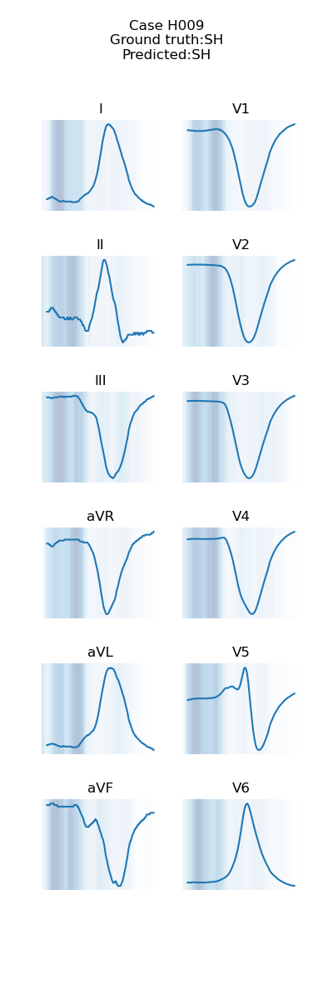

# HML

This is the repository for the His pacing machine learning project.

The open access manuscript is available [here](https://www.cvdigitalhealthjournal.com/article/S2666-6936(20)30005-0/fulltext#.X0ZswM0RkhQ.twitter)

`train.py` - Train the 3 CNNs via 3-fold cross-validation across the training set

`test.py` - Evaluate the ensembled 3 CNNs on the testing dataset

`vis.py` - Create the saliency maps

The pre-trained networks are available in `output/models/`

Saliency maps for the entire testing set are available in `output/vis/`
 

The Python version used is `3.8` and the following packages are required (all installed by with `conda` via the `conda-forge` channel)
* `matplotlib`
* `pytorch v1.5` & `torchvision` (pytorch conda channel)
* `pyyaml`
* `numpy`
* `pandas`
* `scikit-image`
* `scikit-learn`
* `scipy`
* `statsmodels`
* `tqdm`
* `xlrd`
